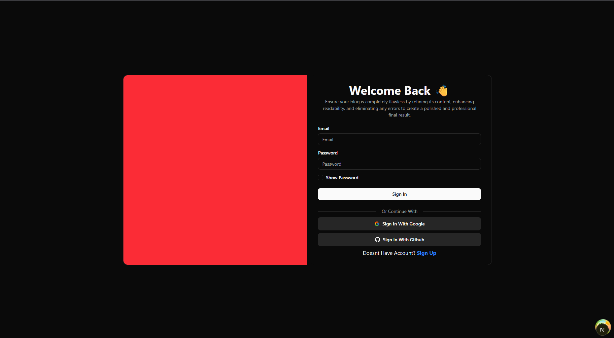
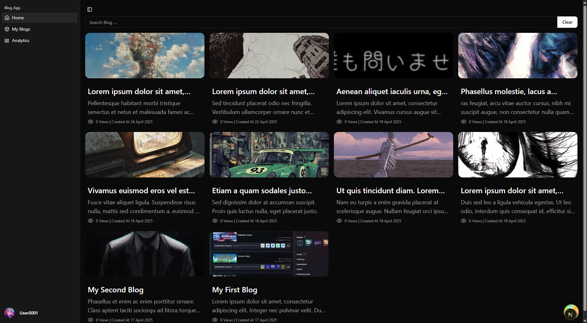
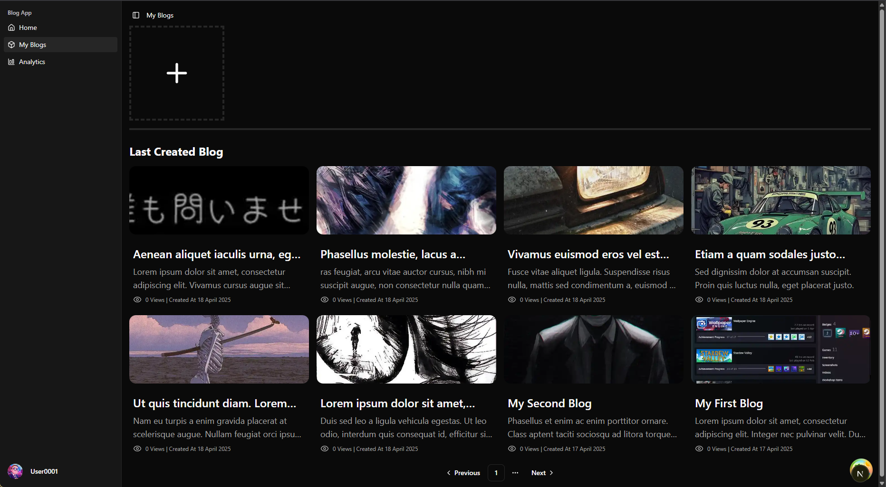
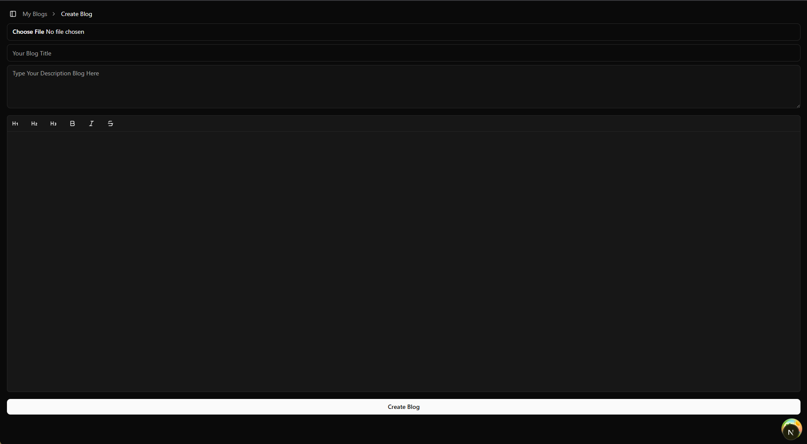

# 📝 Next.js Blog App

a web application to post and manage your blogs, built with **Next.js** and **Hono**.

## Preview

<p align="center">
  
  
  <br/>
  
  
</p>

## 🛠 Tech Stack

- [Next.js](https://nextjs.org/)
- [Hono](https://hono.dev/)
- [Shadcn UI](https://ui.shadcn.com/)
- [Prisma ORM](https://www.prisma.io/)
- [Supabase](https://supabase.com/)

## 🚀 Features

- 🔐 Supabase Authentication & Storage
- 🧱 RESTful API Architecture
- 📄 Pagination
- ♾️ Infinite Scrolling
- 🔎 Search Functionality

## 📦 Installation

Follow these steps to get started:

```bash
git clone https://github.com/MammonXXIX/Nextjs-Blog-App.git

cd blog-app

npm install

config .env file

npm run dev
```
